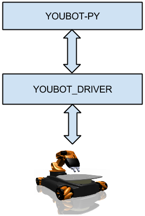

.. youbot-py documentation master file, created by
   sphinx-quickstart on Sun Dec 22 13:18:19 2013.
   You can adapt this file completely to your liking, but it should at least
   contain the root `toctree` directive.

youBot-py (Under Development)
===========================================================

* **The first stable release 1.0.0 will be made available on 15.01.2014**
For the changes happening, refer to :ref:`changelog`

This wrapper is intended as python library for youbot :

- The youbot-py is a pure python wrapper for youbot.
- Protoytping and a scripting layer has become an inevitable entity. 
- Developing a python wrapper for youBot with out any dependency of framework was the aim of this wrapper.
- Interfaces(Jacobian,Analytical IK, Trajectory Generation and Control and so on) for a robotic development will be included.
- In order to request new features, please raise ticket to hotline@youbot-store.com.
- For help in installation and reporting issues, add a issue in git hub https://github.com/praman2s/youbot-py/issues

.. toctree::
   :maxdepth: 3

Major Releases
*******************

The major releases does not include or plan for bug fixes.
The bug fix release will happen as soon as a bug is found

==================   ================    ==================
Month-year             Release             Functions
==================   ================    ==================
Jan15-2014            V0.1                Support for Arm
Jan30-2014            V0.2                Support for Base
Feb15-2014            V0.3                Independent of Boost at Driver 
==================   ================    ==================
	

Installation
==================

Please follow the below installation instructions:

Building and Installing the wrapper:

* Build and Install.

                - git clone https://github.com/praman2s/youbot-py.git
                - cd youbot-py
		- sh configure.sh
                - python setup.py build --build-base=.
		- sudo bash
                - python setup.py install

Now the wrapper is ready to be tested.

Manual
==================

The whole wrapper is divided into three parts:

- Communication with youbot.
- Getters and Setters for youbot arm.
- Getters and setters for youbot base.

Communication with youbot
*********************************
This sets up the communication between PC and youBot ethercat drivers::

	from youbotpy import *     # Imports all the modules that are being exposed
	robot = robot()            # Tries to establish connection, if not throws exception
	robot.Calibrate()          # Optional. For some users who want candle positon as initial pose.

           

Getters and Setters for youbot arm
***********************************
The wrapper allows you to work with arm alone. Config files have to altered accordingly::
	
	arm  = robot.GetArm()       	# Get the first arm connected.
	arm.GetJointValues()	    	# Returns the current joint value as 5x1 array.
	arm.SetJointValues(value)   	# Sets joint values. value should be 5x1 array.
	arm.GetVelocityValues()	     	# Returns the current joint velocity as 5x1 array.
	arm.SetVelocityValues(value) 	# Sets joint velocity values. value should be 5x1 array.
	arm.GetTorqueValues()	    	# Returns the current joint torque values as 5x1 array.
	arm.SetTorqueValues(value)   	# Sets joint toruque values. value should be 5x1 array.

Getters and Setters for youbot base
************************************

The wrapper allows you to work with base alone. Config files have to altered accordingly::
	
	base = robot.GetBase()  	# Tries to check if the base is connected.
	base.SetVelocity([x,y,theta]) 	# Sets the base velocity to x,y and theta.
	base.GetVelocity()              # Returns a 3x1 (x,y,\theta) velocity vector.
	base.GetPose()                  # Returns the pose info based on odometry.

Examples
==================

This is an example file where it takes three lines to get connected to youBot::

	from youbotpy import *   #exposes youbot_driver to python
	import time

	robot = robot()    # Calls the constructor . Important to call at the begining
	robot.Calibrate()  # Sets the robot in candle position and sets encoder to zero
	joint_values = [1,1,1,1,1] # some position that of the arm that the user demands
	robot.SetArmJointValues(joint_values) # sets the joint values
	time.sleep(2)
	current = time.time()

	while (time.time()-current < 5):
		robot.SetBaseVelocity([0.1,0,0]) #Sets the base velocity to x - 0.1 for 5 seconds

	print "End of Hello World..!!!"

.. _youbot_driver: https://github.com/youbot/youbot_driver
.. _youbot-store: http://www.youbot-store.com/

.. raw:: html

	

